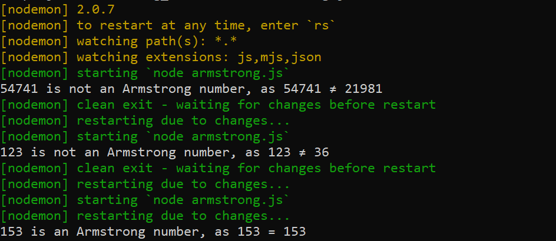
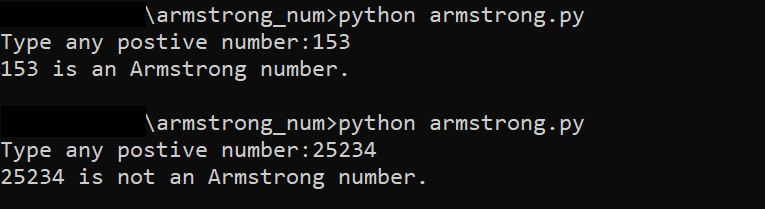

# Armstrong_num
## Python Program/ Javascript Program to Check Armstrong Number. You can check whether an n-digit integer is an Armstrong number or not

## Here are some screen shots

  
   
  

## Editor used 

## Built with 

 
 
 

 ## Cloning this repositary using command line
 1. Open **Git Bash**.
 1. Change the current working directory to the location where you want the cloned directory.
 1. Type `git clone https://github.com/Sagar-Sharma-7/Armstrong_num.git`
 1. Press **Enter** to create the clone of this repositary.
  

## License 
### The scripts and documentation in this project are released under the MIT License 

 

## Contributions
### Contributions are welcome! see [Contribution's Guide](https://github.com/Sagar-Sharma-7/dictionary/blob/main/CONTRIBUTING.md)

 

## Code of Conduct 
 

### Be nice. See our [code of conduct](https://github.com/Sagar-Sharma-7/dictionary/blob/main/CODE_OF_CONDUCT.md)

 

 ## How to reach me?
 
 

  

 

 

